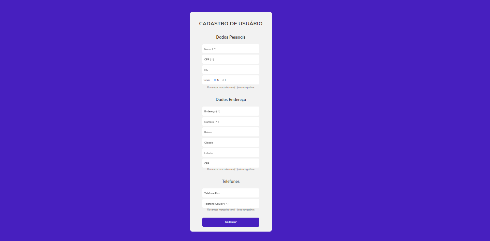

# Desafio Form de Cadastro Pessoal - Gama Academy

#### Autores
- [Matheus Rodrigues](https://github.com/matheus-rodrigues00)

- [Link do Projeto no Netlify](https://quirky-poitras-7ae416.netlify.app/)

## Funcionalidades
O projeto tem como principal funcionalidade obter os dados digitados nos inputs do formulário para o cadastro do usuário e verificar os campos obrigatórios, exibindo alerts de form submetido com sucesso ou dados obrigatórios incompletos.

## implementações Relevantes
- A implementação mais relevante do projeto foi do input com o placeholder personalizado, animado apenas com o CSS. 
- Outra implementação interessante foi a de retirar as setas do input "number".
- Implementei também o input do tipo "radio", para adicionar o select no campo "sexo".

## Links de Pesquisas
- [Input Com Placeholder Especial](https://codepen.io/avstorm/pen/gKGbxo)
- [Como Retirar Setas do Input Number](https://www.w3docs.com/snippets/css/how-to-hide-the-html5-number-inputs-arrow-buttons.html)
- [Como Implementar Imput do Tipo Radio](https://developer.mozilla.org/en-US/docs/Web/HTML/Element/input/radio)

"# itauTechDesafio" 
# desafioItauTechGamaAcademy
